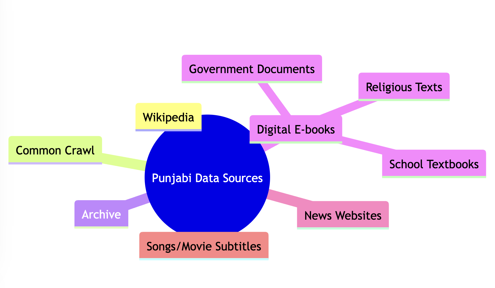

# Punjabi Data Collection Project

Welcome to the Punjabi Data Collection Project! This project aims to gather and organize various sources of Punjabi language data for research, educational, and cultural preservation purposes. Below is an overview of our data sources and the thought process behind their selection.

## Project Overview

The goal of this project is to compile a comprehensive dataset of Punjabi language content from diverse sources. This will help in linguistic analysis, machine learning model training, and cultural studies.

## Data Sources

Our data collection strategy revolves around the central theme of **Punjabi Data Sources**, which branches out to various categories. Here's how we categorize our sources:

### 1. Common Crawl
- **Description**: A repository of web crawl data, which includes Punjabi content from various websites.
- **Usage**: This will provide us with a broad base of text data from the internet, which can be filtered for Punjabi content.

### 2. Archive
- **Description**: Digital archives containing historical Punjabi documents, books, and manuscripts.
- **Usage**: Important for preserving and studying historical linguistic patterns and cultural texts.

### 3. Wikipedia
- **Description**: Punjabi Wikipedia pages.
- **Usage**: Provides structured, reliable, and educational content in Punjabi.

### 4. Digital E-books
- **Description**: E-books available in Punjabi, ranging from literature to educational material.
- **Usage**: Offers contemporary usage of language, literature, and educational content.

  - ### a. Government Documents
    - **Description**: Official documents published by Punjabi-speaking regions' governments.
    - **Usage**: Useful for formal language usage, legal terminology, and public administration language studies.

  - ### b. Religious Texts
    - **Description**: Sacred texts written in Punjabi, including Sikh scriptures and other religious writings.
    - **Usage**: Essential for understanding religious and cultural context within the language.

  - ### c. School Textbooks
    - **Description**: Textbooks used in Punjabi language schools.
    - **Usage**: Provides insight into educational language use, standard curriculum content, and children's literature.

### 5. News Websites
- **Description**: News articles in Punjabi from various news websites.
- **Usage**: Keeps the dataset current with modern language usage, journalism style, and public discourse.

### 6. Songs/Movie Subtitles
- **Description**: Lyrics of Punjabi songs and subtitles of Punjabi movies.
- **Usage**: Captures colloquial language, slang, idiomatic expressions, and the evolving spoken language.

---

## Thought Process

The selection of these sources is driven by the need to cover various aspects of the Punjabi language:
- **Diversity**: From formal to informal, modern to historical, religious to secular, ensuring a broad representation of language use.
- **Accessibility**: Choosing sources that are publicly available or can be legally accessed for research purposes.
- **Relevance**: Each source contributes uniquely to understanding different facets of language, culture, and usage.

## How to Contribute

If you're interested in contributing to this project:
- **Fork the Repository**: Make your own copy of this project.
- **Add Data**: Collect data from the above sources, ensuring you mention the licensing where applicable.
- **Submit a Pull Request**: Share your contributions back with us for review and inclusion.

